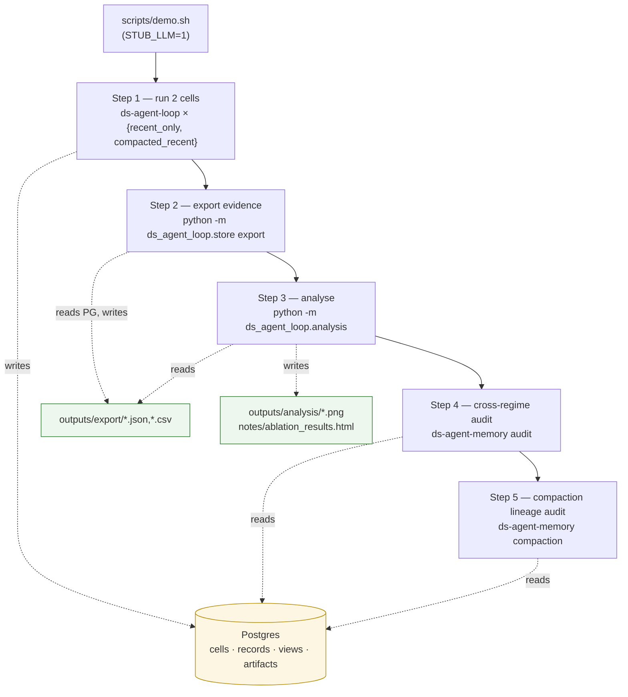
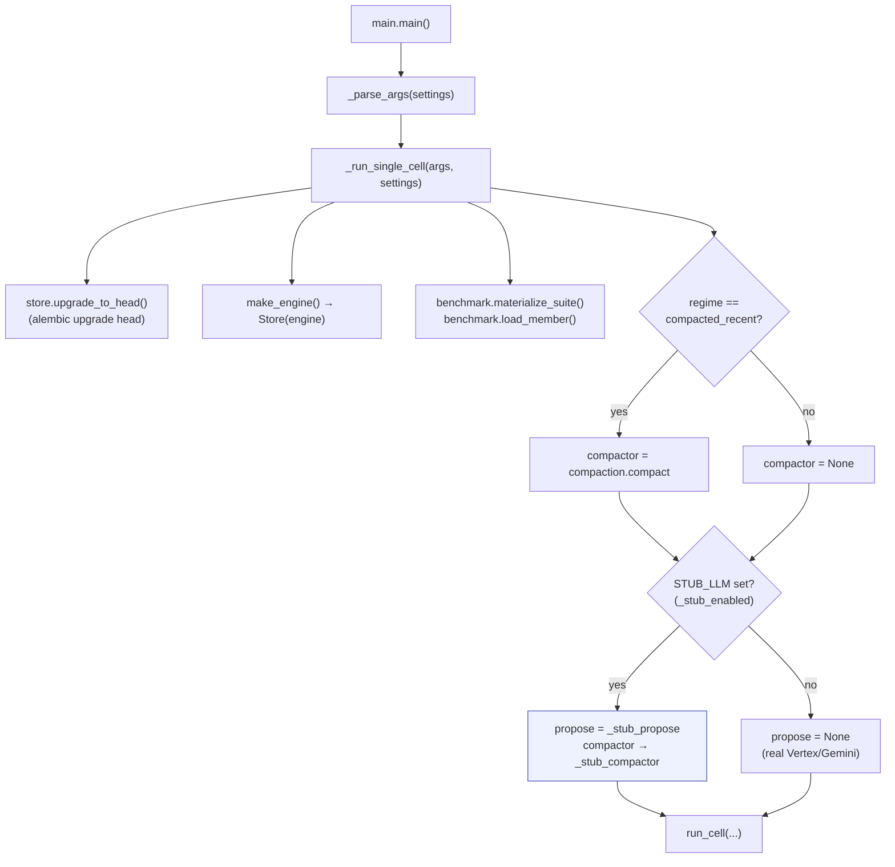
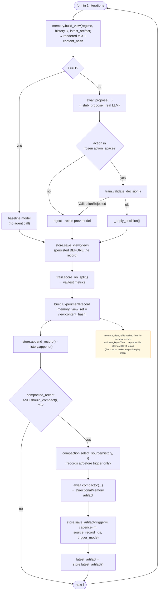
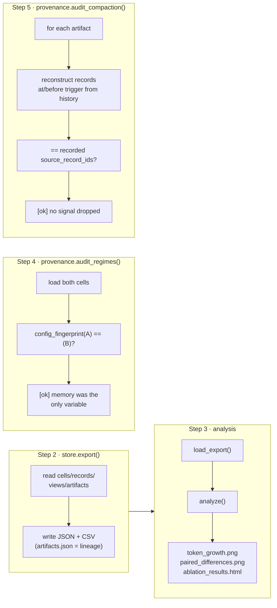

# Demo Flow — what `scripts/demo.sh` actually runs

A code-level trace of [`scripts/demo.sh`](../scripts/demo.sh). The script is five shell
steps; each shells out to a console entry point (`ds-agent-loop`, `ds-agent-memory`, or a
`python -m …` module) that drives the library in `src/ds_agent_loop/`. Everything runs offline
because `demo.sh` exports `STUB_LLM=1`, which swaps the real Vertex/Gemini calls for
deterministic in-process stubs.

> `member|regime|s<seed>|k<k>|m<m>` is a *cell* — one experiment run. The demo records two
> cells (`recent_only` + `compacted_recent`), then exports, analyses, and audits them.

---

## 1. Top-level: the five demo steps

---

## 2. Step 1 — `ds-agent-loop` runs one cell

Console script `ds-agent-loop` → `main.main()`. The `STUB_LLM` branch (added for the demo)
wires the offline proposer/compactor before delegating to the shared `run_cell` loop.

---

## 3. Inside `run_cell` — the per-iteration loop

For `i = 1 … iterations`: build the exact memory view → ask the agent → validate → train/score
→ persist the view and the record. For `compacted_recent`, an **outer compaction loop** fires
at cadence `m`. This is where the green audits in steps 4–5 get their evidence.

---

## 4. Steps 2–5 — export, analyse, audit

The agent never runs again here; these steps only read persisted state. The two audits are
**deterministic and make zero LLM calls**.

---

## Key files

| Concern | File |
|---|---|
| Orchestrator + `run_cell` loop + `STUB_LLM` wiring | `src/ds_agent_loop/main.py` |
| Memory view rendering (`build_view`, `sort_keys` fix) | `src/ds_agent_loop/memory.py` |
| Compaction operator (`should_compact`, `select_source`, `compact`) | `src/ds_agent_loop/compaction.py` |
| Train / validate / score | `src/ds_agent_loop/train.py` |
| Persistence (Postgres) + `export` | `src/ds_agent_loop/store.py` |
| Replay + cross-regime + compaction audits | `src/ds_agent_loop/provenance.py` |
| Analysis + report | `src/ds_agent_loop/analysis.py` |
